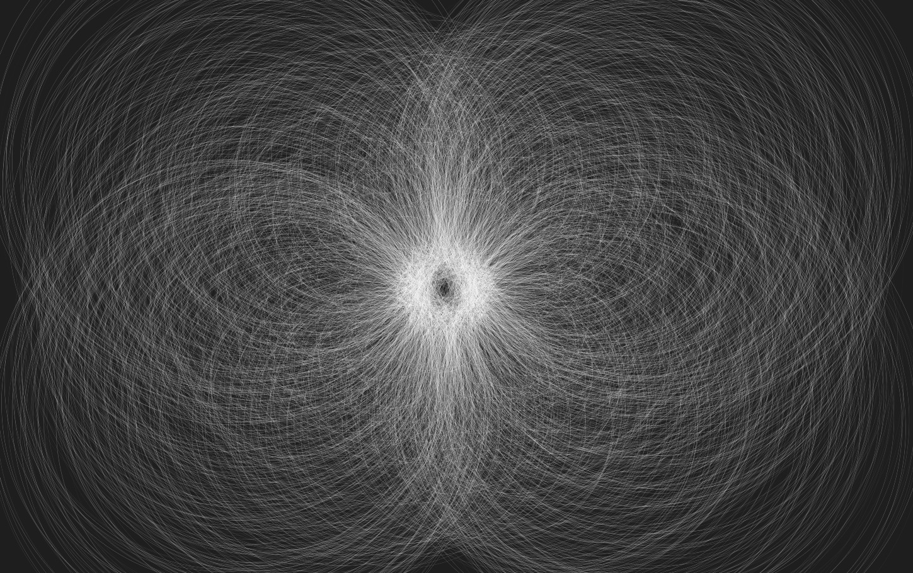

# Deformation



---

### An Exploration of Movement, Form, and Interaction

**Deformation** isn’t just an animation. It’s an evolving dance of particles, a symphony of geometry, and a canvas alive with motion. Every flicker and wave responds to your presence, inviting you to influence a digital ecosystem that merges precision with chaos.

### What It Does

Deformation creates an immersive, full-screen particle animation driven by elegant, reactive code. Thousands of tiny elements pulsate and transform, drawing arcs and shapes as they follow unseen forces. Their behavior shifts as you move your cursor across the canvas, subtly acknowledging your input and weaving it into their performance.

Whether it's mathematical curves or seemingly random flows, each frame is an ephemeral piece of digital art—gone as quickly as it’s formed. It's a canvas that listens and evolves.

### How It Works

1. **Particles**: The animation generates a dynamic number of particles based on screen size, ensuring seamless adaptation to any resolution.
2. **Interaction**: Hover over the canvas, and the particles respond, curving toward or away from your presence in mesmerizing formations.
3. **Responsiveness**: The canvas resizes dynamically, ensuring a full-screen experience, no matter the device or window dimensions.
4. **Customization**: You can tweak particle density, resolution, and motion parameters in the source to craft your unique aesthetic.

### Experience It

Open the project in your browser and let your imagination wander through waves of shape and light. Here, the boundaries between art and code blur into a playground of endless possibilities.

### Getting Started

1. Clone the repository:
   ```bash
   git clone https://github.com/QC20/Deformation.git
   ```
2. Open `index.html` in your browser.

### Customize Your Canvas

Dive into `sketch.js` to:
- Increase or reduce particle density by adjusting the `res` variable.
- Change canvas background colors, particle opacity, and line thickness.
- Create entirely new behaviors by tweaking particle motion and interactions.

### Contributions

Want to add your creative twist? Contributions are welcome! Fork the repository, experiment with the code, and share your enhancements.

---

Deformation is a space where design meets code, where interaction meets artistry. A place for creators, dreamers, and technologists to come together and play.

